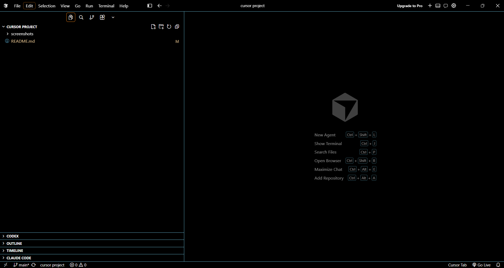
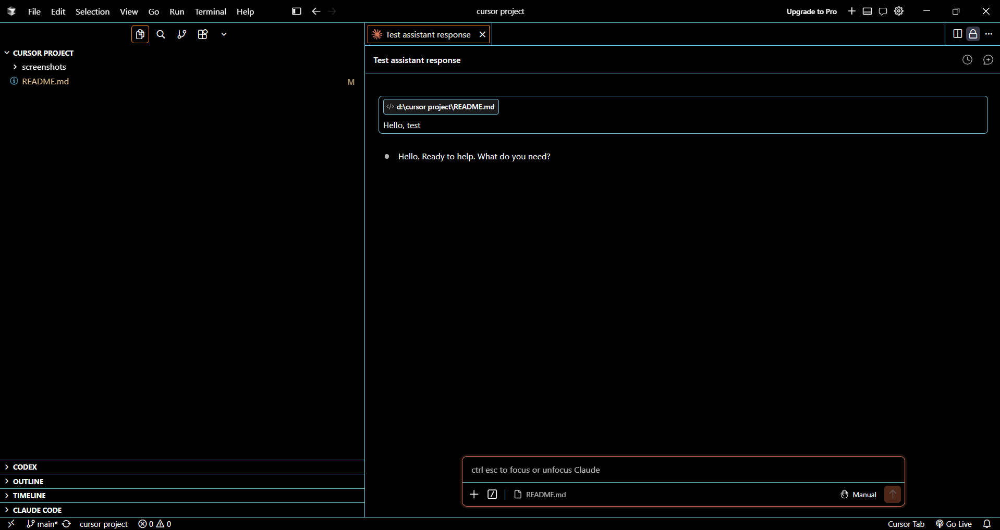
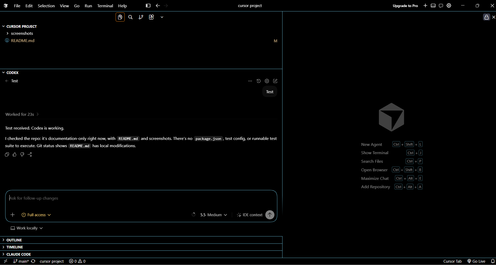
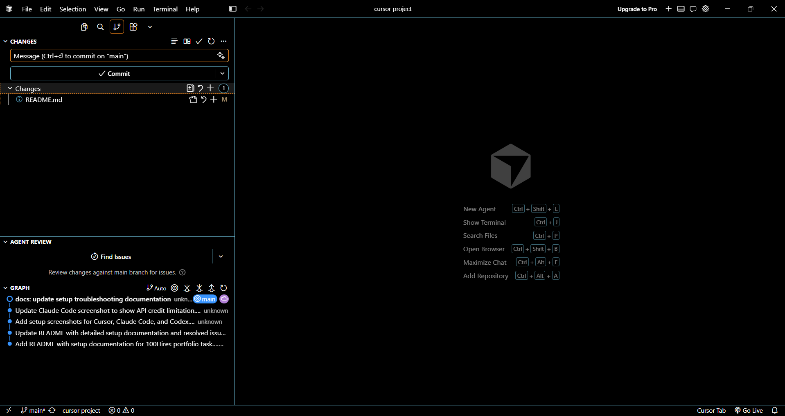
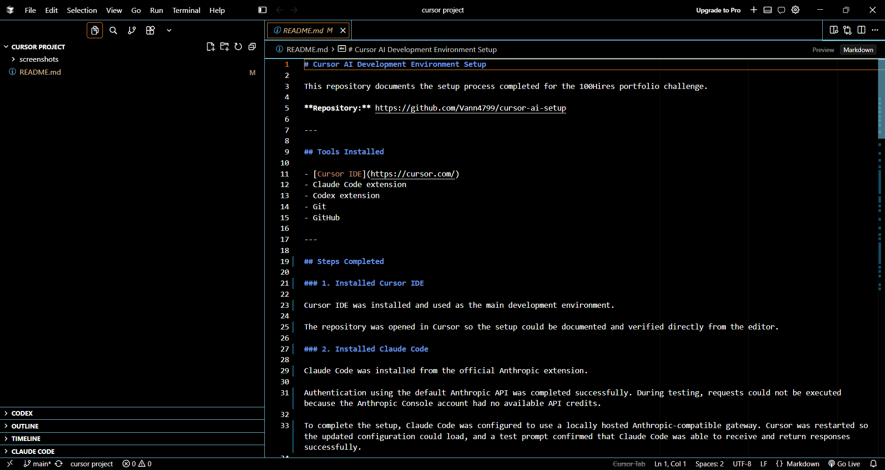
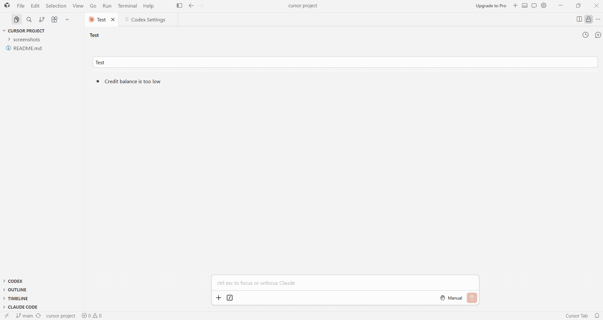
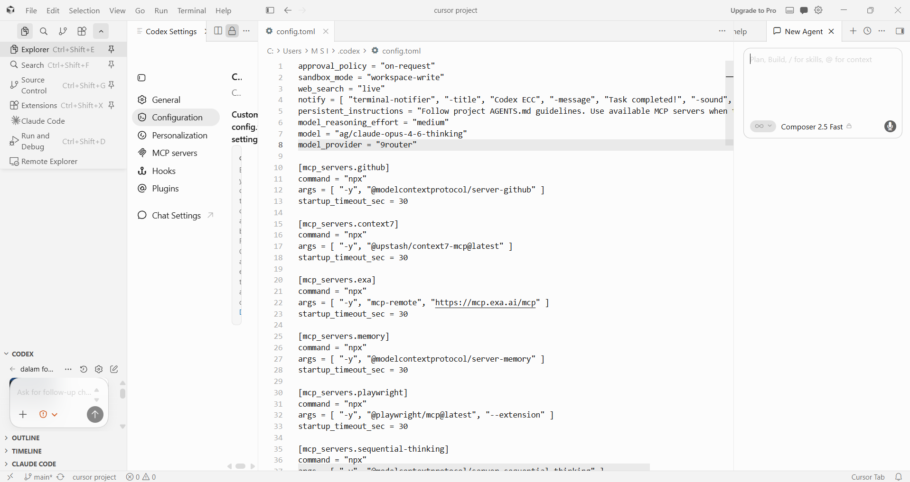
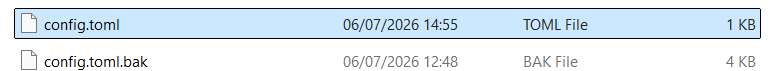

# Cursor AI Development Environment Setup

This repository documents the setup process completed for the 100Hires portfolio challenge.

**Repository:** https://github.com/Vann4799/cursor-ai-setup

---

## Tools Installed

- [Cursor IDE](https://cursor.com/)
- Claude Code extension
- Codex extension
- Git
- GitHub

---

## Steps Completed

### 1. Installed Cursor IDE

Cursor IDE was installed and used as the main development environment.

The repository was opened in Cursor so the setup could be documented and verified directly from the editor.

### 2. Installed Claude Code

Claude Code was installed from the official Anthropic extension.

Authentication using the default Anthropic API was completed successfully. During testing, requests could not be executed because the Anthropic Console account had no available API credits.

To complete the setup, Claude Code was configured to use a locally hosted Anthropic-compatible gateway. Cursor was restarted so the updated configuration could load, and a test prompt confirmed that Claude Code was able to receive and return responses successfully.

No authentication tokens, API keys, or sensitive configuration values are included in this repository.

### 3. Installed Codex

The Codex extension was installed successfully.

At first, Codex reused configuration imported from an existing VS Code setup. To make the setup use the default Codex flow, the existing configuration was backed up by renaming `config.toml` to `config.toml.bak`.

Cursor was restarted, Codex generated a fresh default configuration, and authentication was completed through the OpenAI login flow using Google sign-in.

After authentication, the Codex sidebar was reopened and a test conversation confirmed that Codex was working normally.

### 4. Created GitHub Repository

A public GitHub repository named `cursor-ai-setup` was created under the `Vann4799` account.

### 5. Opened Repository in Cursor

The local repository folder was opened in Cursor and used as the working project for the setup documentation.

### 6. Created README Documentation

This README was created to document:

- What tools were installed
- What steps were completed
- What issues were encountered and how they were resolved

### 7. Committed and Pushed to GitHub

The local repository was connected to the GitHub remote, then the README was committed and pushed to the `main` branch.

---

## Issues Encountered and Resolutions

### Claude Code

**Issue:** Claude Code authentication succeeded, but requests failed because the default Anthropic API account had no available credits.

**Resolution:** Claude Code was configured to use a locally hosted Anthropic-compatible gateway.

The following changes were made:

- Created the user configuration file at `C:\Users\MSI\.claude\settings.json`.
- Added the required environment variable names inside the configuration:
  - `ANTHROPIC_BASE_URL`
  - `ANTHROPIC_AUTH_TOKEN`
- Configured Claude Code to connect to a local Anthropic-compatible endpoint running on localhost instead of the default Anthropic endpoint.
- Restarted Cursor so the new configuration was loaded.
- Verified that Claude Code connected successfully.
- Verified the integration by sending a test prompt inside Cursor.
- Confirmed that Claude Code was able to receive and return responses successfully after the local gateway configuration.

### Codex

**Issue:** Codex initially reused configuration imported from an existing VS Code setup, which pointed to a local gateway.

**Resolution:** The previous Codex configuration was backed up by renaming `config.toml` to `config.toml.bak`. Cursor was restarted so Codex could generate a fresh default configuration. Authentication was then completed through the OpenAI login flow using Google sign-in.

**Issue:** The Codex sidebar was not visible after configuration and layout changes.

**Resolution:** The workspace layout was restored, the Codex sidebar was reopened, and a test conversation confirmed that the extension worked correctly.

---

## Screenshots

The screenshots document the final working environment after setup and troubleshooting.

### Cursor IDE with Repository Open

### Claude Code Responding

### Codex Sidebar Working

### Source Control Changes

### README Edited in Cursor

## Troubleshooting Evidence

These screenshots document the issues found during setup and the configuration changes used to resolve them.

### Claude Code API Credit Limitation

### Codex Imported Configuration

### Codex Configuration Backup

---

## Environment

| Component | Details |
|-----------|---------|
| Operating System | Windows 11 |
| IDE | Cursor |
| Version Control | Git |
| Repository Hosting | GitHub |

---

## Result

Cursor, Claude Code, Codex, Git, and GitHub were installed and configured successfully.

Claude Code was verified through a locally hosted Anthropic-compatible gateway. Codex was restored to its default configuration and verified through OpenAI authentication.

**README link:** https://github.com/Vann4799/cursor-ai-setup/blob/main/README.md
