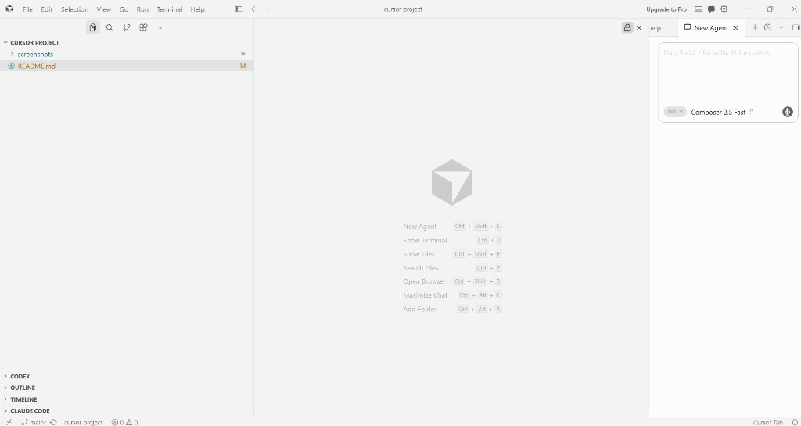
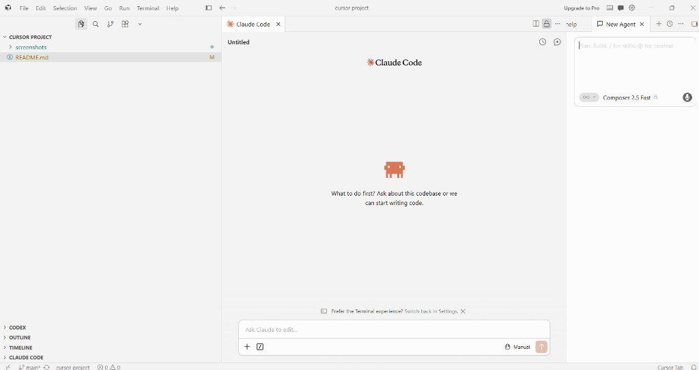
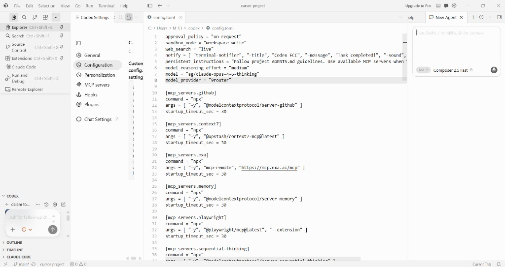
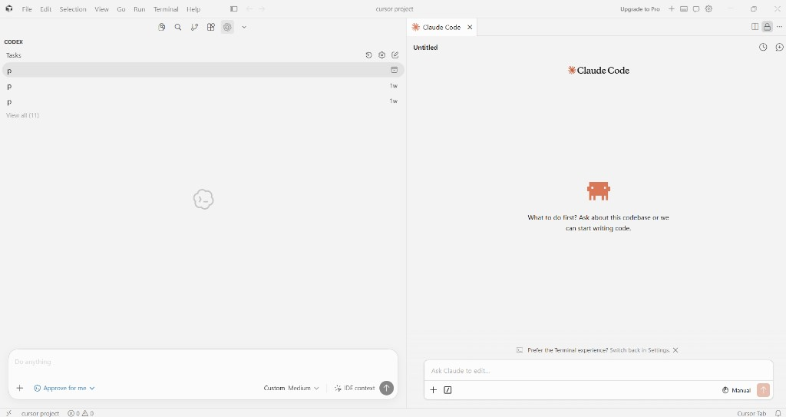

# Cursor AI Development Environment Setup

This repository documents the setup process requested as part of the 100Hires portfolio challenge.

**Repository:** https://github.com/Vann4799/cursor-ai-setup

---

## Tools Installed

- [Cursor IDE](https://cursor.com/)
- Claude Code Extension (Anthropic)
- Codex Extension
- Git
- GitHub

---

## Steps Completed

### 1. Installed Cursor IDE

Downloaded and installed the latest version of Cursor IDE from [cursor.com](https://cursor.com/).

### 2. Installed Claude Code

Installed the official Claude Code extension published by Anthropic and authenticated successfully using an Anthropic account.

### 3. Installed Codex

Installed the official Codex extension.

Instead of using the default configuration, I configured the extension to use my existing local AI gateway by updating the extension configuration (`config.toml`). The gateway exposes a local endpoint that manages multiple AI providers through a single interface. After updating the configuration, I verified that Codex authenticated successfully using the local endpoint.

### 4. Created GitHub Repository

Created a new public GitHub repository named `cursor-ai-setup` under account `Vann4799`.

### 5. Opened Repository in Cursor

Opened the repository inside Cursor IDE and initialized the local Git project.

### 6. Created Documentation

Created this README file documenting the installation process, completed steps, and issues encountered.

### 7. Committed and Pushed to GitHub

Committed the README and pushed it to the `main` branch on GitHub.

---

## Screenshots

### Cursor IDE — Project Open



### Claude Code — Installed & Ready



### Codex — Custom Gateway Configuration



### Codex & Claude Code — Both Extensions Running



---

## Issues Encountered

### Claude Code — API Credits

Although authentication was successful, Claude Code could not execute requests because the Anthropic API account had no available API credits.

**Resolution:**

- Verified that authentication completed successfully.
- Confirmed the limitation was caused by API billing rather than installation or configuration.

### Codex — Custom Configuration

The default authentication method was not used.

**Resolution:**

- Inspected the extension configuration.
- Updated the local `config.toml` to connect Codex to my existing local AI gateway.
- Verified the endpoint configuration.
- Confirmed successful authentication.

### Git — Connecting Local Project to GitHub

After creating the empty GitHub repository, the local folder had no remote configured and no commits yet.

**Resolution:**

```bash
git remote add origin https://github.com/Vann4799/cursor-ai-setup.git
git add README.md
git commit -m "Add README with setup documentation"
git branch -M main
git push -u origin main
```

### PowerShell — Command Chaining

Chaining commands with `&&` failed on older PowerShell versions on Windows.

**Resolution:** Used semicolons (`;`) to run multiple commands sequentially, or ran each command separately.

---

## Environment

| Component | Details |
|-----------|---------|
| Operating System | Windows 11 |
| IDE | Cursor |
| Version Control | Git |
| Repository Hosting | GitHub |

---

## Summary

All required tools were installed successfully.

Both Claude Code and Codex were configured and authenticated successfully. During setup, I also verified the extension configuration and customized the Codex connection to use my preferred local AI gateway through its configuration file.

The repository is now ready for the next stage of the project.

**README link:** https://github.com/Vann4799/cursor-ai-setup/blob/main/README.md
